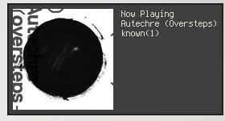

mpdnotify
=========

### Synopsis
mpdnotify is a simple bash script that uses notify-send
and mpc to create notifications about what song is currently
playing in mpd.

### Requirements
 * mpd
 * mpc
 * notify-send (libnotify)
 * standard UNIX tools (find, egrep, head)
 * ImageMagick (convert) [optional]

### Download

Just fetch this repo with git:
`git clone git://github.com/vehk/mpdnotify.git`

### Usage
This script now uses a config file located in
`$XDG_CONFIG_HOME/mpdnofity.conf`. A config template comes with the script;
Copy it over to `$XDG_CONFIG_HOME` and edit it to your liking.

The only thing left to do is to set up a program that will run
the script whenever a new song is playing.
I use the `execute_on_song_change` option in `ncmpcpp` in order to do that.

In order to display cover art, you need to tell `mpdnotify` where your music
directory is. The script will then look for image files in the directory that
contains the currently playing track.

The default regex expressions for cover art identification will match:
`(front|cover|art)\.(jpg|jpeg|png)$`

Before being passed to notify-send, every cover is resized with ImageMagick
according to the geometry given in the corresponding setting.

As mpd honors the `MPD_{HOST,PORT}` environment variables, you can access remote
MPD instances: `MPD_HOST=192.168.0.200 mpdnotify`

Note, however, that mpdnotify cannote locate album covers this way unless you
have a local copy of them in a folder equal in structure as the music folder on
the remote instance.

### Usage with mpdcron
As a nice alternative to a client bound hook there is
[mpdcron](http://alip.github.com/mpdcron/).

Install it on your system, configure mpdcron.conf to listen for player changes
and add to ~/.mpdcron/hooks/player
`[[ "$MPD_STATUS_STATE" = play ]] && mpdnotify`

Remember to `chmod +x ~/.mpdcron/hooks/player`.

### Logfile
To prevent mpdnotify from spamming output to the invoking program, any output
(STDOUT and STDERR) from both `convert` and `notify-send` is sent to
`$HOME/.mpdnotify.log` by default (this can be changed in the configuration
section of the script).

### Screenshot

Because notify-send will look different depending on the window manager (etc.),
this screenshot is only an example and shows mpdnotify using awesome wm with
the zenburn theme.

### License
You can use, edit and redistribute this script in any way you like.
(Just make sure not to hurt any kittens)
